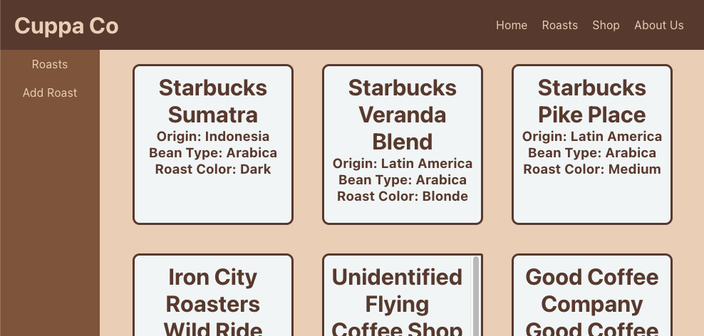
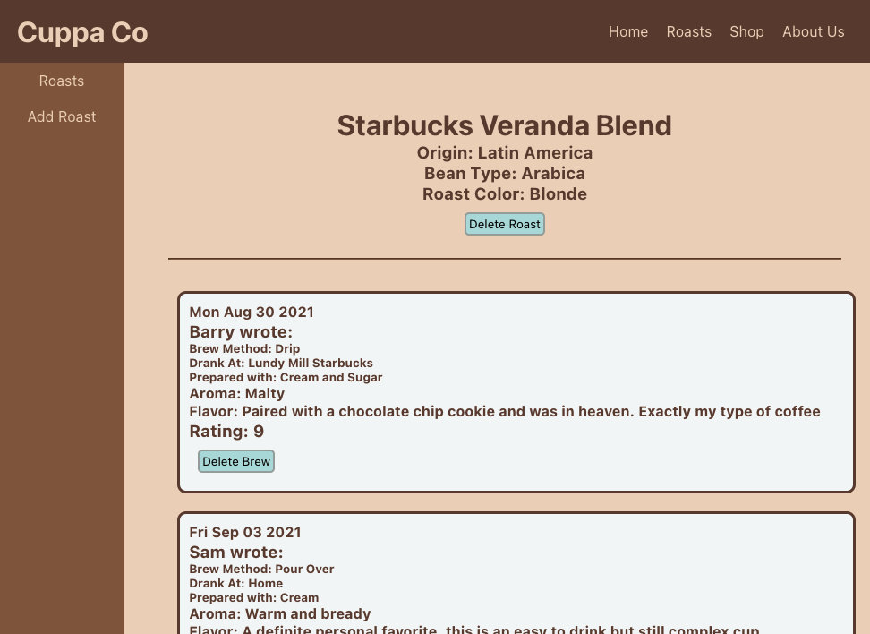

# CuppaCo

## Date: 9/5/21

#

### By: Sam Phillips

[GitHub](https://github.com/samkphillips) | [LinkedIn](https://www.linkedin.com/in/sam-phillips-8ba677168/)

#

**_Description_**

Cuppa Co is a coffee review and journaling site. Users can add their favorite roasts, then submit reviews called "Brews" that rate the coffee as well as guide users to enjoy the subtleties of that cup of coffee.

---

**_Technologies Used_**

- React
- Node
- MongoDB
- Express
- Heroku
- Several different coffee brewing methods

---

**_Getting Started_**

Head to [Cuppa Co](https://peaceful-tor-59169.herokuapp.com/) and click "Roasts" to get started. Add your favorite coffee and contribute a review!

---

**_Screenshots_**

#### Roasts

#### Brews

---

**_To Do_**

- [ ] Add user accounts to aid in finer control of updating and deleting past brews
- [ ] Add roast search
- [ ] Add roast and brew pagination
- [ ] Add ability to upload images of roasts and brews

---

**_Credits_**

Color Scheme made on [Coolors](https://coolors.co/)

Icons from [FlatIcon](https://www.flaticon.com/)

Screenshots include some real Starbucks roasts. All credits go to its rightful owner per fair use, etc.
