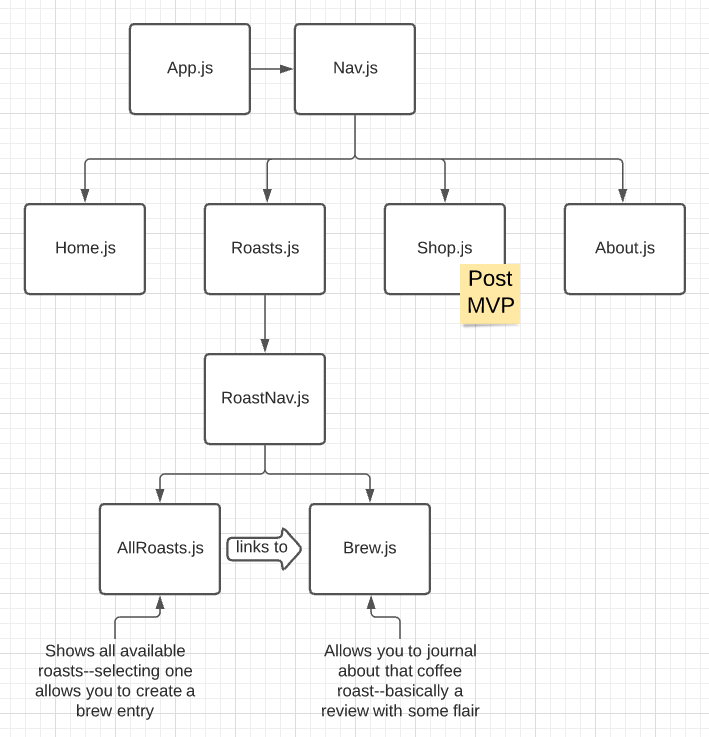

# CuppaCo

## Date: 8/29/21

#

### By: Sam Phillips

[GitHub](https://github.com/samkphillips) | [LinkedIn](https://www.linkedin.com/in/sam-phillips-8ba677168/)

#

**_Description_**

Cuppa Co will be a coffee journalling website where users can find roasts, journal their coffee escapades, and (maybe someday) find recommendations for new coffee and coffee paraphenelia.

---

**_Technologies Used_**

- React
- Node
- MongoDB
- Express
- Several different coffee brewing methods

---

**_Getting Started_**

Just go to the site and click awayyyy

---

**_Screenshots_**

#### Soon!

---

**_To Do_**

Everything

---

**_Planning_**

Planning and development was managed on [Trello](https://trello.com/b/S6t1W12N/cuppaco)

#### Component Heirarchy Diagram

#### Entity Relationship Diagram

#### Sketch of Journal Page

#### Color Scheme

---

**_Credits_**

[Color Scheme made on Coolors](https://coolors.co/)
